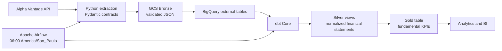

# Fundamental Data Analysis Pipeline

[](https://github.com/hallyfred/fundamental_data_analysis/actions/workflows/ci_cd.yml)
[](https://hallyfred.github.io/fundamental_data_analysis/)

A local-first data engineering pipeline that collects fundamental financial data from Alpha Vantage, preserves validated JSON payloads in Google Cloud Storage, and builds analytics-ready Silver and Gold models in BigQuery with dbt. Apache Airflow coordinates the complete workflow and enforces the API budget.

> **Project status:** The five Silver models and the Gold KPI mart are implemented and validated. The reproducible local Docker runtime passes 70 Python tests; BigQuery validation has also passed 30 dbt unit tests and 27 dbt data tests. Production readiness still requires the controlled seven-day round-robin observation and day-eight idempotency check described in the [production validation checklist](docs/round-robin-production-validation.md).

## Contents

- [What the pipeline does](#what-the-pipeline-does)
- [Architecture](#architecture)
- [Round-robin ingestion](#round-robin-ingestion)
- [Data model and KPIs](#data-model-and-kpis)
- [Quickstart on Windows](#quickstart-on-windows)
- [Working with dbt](#working-with-dbt)
- [Published dbt documentation](#published-dbt-documentation)
- [Testing and CI](#testing-and-ci)
- [Local operations](#local-operations)
- [Project structure](#project-structure)
- [Known limitations](#known-limitations)

## What the pipeline does

The pipeline processes five Alpha Vantage endpoints:

- `OVERVIEW`
- `INCOME_STATEMENT`
- `BALANCE_SHEET`
- `CASH_FLOW`
- `EARNINGS`

For every selected ticker, it:

1. Fetches each endpoint through a rate-limit-aware Python client.
2. Validates the response against Pydantic contracts and quarantines invalid payloads.
3. Stores accepted JSON in date-partitioned GCS Bronze paths and updates endpoint watermarks only after successful uploads.
4. Creates or refreshes BigQuery external tables for non-CI dbt targets.
5. Normalizes the raw fields into five Silver views.
6. Builds the Gold `fct_fundamental_kpis` table and runs its quality gates.

Failures, rate limits, quarantines, and incomplete batches stop downstream work. Extraction summaries record planned, completed, failed, and pending tickers and are uploaded to GCS metadata paths.

## Architecture



| Layer | Technology | Responsibility |
| --- | --- | --- |
| Ingestion | Python, Requests, Pydantic | API access, schema validation, rate-limit handling, quarantine, and watermarks |
| Bronze | Google Cloud Storage | Validated source payloads partitioned by ingestion date |
| Silver | BigQuery and dbt | Type normalization, sentinel cleanup, deduplication, and complete contract coverage |
| Gold | BigQuery and dbt | Financial statement joins and business-ready KPI calculations |
| Orchestration | Apache Airflow and Cosmos | Scheduling, serial extraction, dbt execution, failure propagation, and alerting |
| Runtime | Docker Compose | Airflow webserver, scheduler, initialization, and PostgreSQL metadata database |

## Round-robin ingestion

The configured Alpha Vantage plan assumes a limit of 25 API calls per day. Five endpoints allow a maximum batch of five companies per run.

- The 35-ticker universe is versioned in [`config/config.py`](config/config.py) as seven batches of five tickers.
- The DAG selects a batch from `data_interval_end` in `America/Sao_Paulo`, so reruns of the same logical interval select the same companies.
- Endpoint tasks run serially and make one HTTP attempt per ticker. One complete daily batch therefore uses at most 25 calls.
- A rate limit or partial extraction fails the current task, leaves unfinished tickers visible in the summary, and blocks dbt.
- The eighth logical day wraps to the first batch and provides the planned idempotency checkpoint.

Do not unpause the DAG or manually retry an extraction until the API quota is known to be available. Use the [round-robin production validation checklist](docs/round-robin-production-validation.md) to record the seven-day cycle.

## Data model and KPIs

### Silver

The five `intermediate` views expose every scalar field declared in [`src/extract/contract.py`](src/extract/contract.py):

- `int_overview`
- `int_income_statement`
- `int_balance_sheet`
- `int_cash_flow`
- `int_earning`

Statement models retain the latest ingestion at grain `(symbol, fiscaldateending, report_type)`. `int_overview` retains the latest snapshot per `symbol`. API sentinel values such as `None`, `-`, `N/A`, and empty strings become `NULL`, and numeric and date conversion use BigQuery safe functions.

Invalid fiscal dates remain visible as `NULL` and fail the quality gate. Each model includes column documentation, source-field metadata, native dbt unit tests, and data tests.

Silver remains materialized as views. The views always expose the current Bronze partitions and avoid maintaining another stored copy while the source volume is small.

### Gold

`fct_fundamental_kpis` is a denormalized table anchored on income statement periods at grain `(symbol, fiscaldateending, report_type)`. Missing companion statements preserve the income row with `NULL` metrics. Overview values represent the latest company snapshot and are identified by `overview_snapshot_date`.

The Gold table uses a full rebuild on every dbt run. This deliberately recalculates window-based growth, late-arriving financial periods, and historical rows enriched by the latest overview snapshot. BigQuery partitions the result by `fiscaldateending` and clusters each partition by `symbol` and `report_type` for date-range and company-level queries.

| Business area | KPI | Calculation or source |
| --- | --- | --- |
| Profitability | ROE | Net income / closing shareholders' equity |
| Profitability | Net margin | Net income / total revenue |
| Profitability | EBITDA margin | EBITDA / total revenue |
| Financial risk | Net debt / EBITDA | `(total debt - cash) / EBITDA` |
| Liquidity | Current ratio | Current assets / current liabilities |
| Cash generation | Free cash flow | Operating cash flow - capital expenditure |
| Earnings quality | Quality of earnings | Operating cash flow / net income |
| Growth | Revenue YoY growth | `LAG(4)` for quarterly periods and `LAG(1)` for annual periods |
| Earnings | Earnings surprise | Alpha Vantage earnings surprise percentage |
| Valuation | P/E and EV/EBITDA | Latest Alpha Vantage overview snapshot |

Safe arithmetic preserves `NULL` when inputs are missing or a calculation is invalid. Ratios and margins are stored as fractions, while earnings surprise follows the percentage representation returned by the API.

## Quickstart on Windows

### Prerequisites

- Git and Docker Desktop with Docker Compose.
- An Alpha Vantage API key with a known available daily quota.
- A GCP project with BigQuery and Cloud Storage enabled.
- A service account that can read and write the Bronze bucket, create and update the required datasets and tables, and run BigQuery jobs.
- A downloaded service-account JSON key.

### 1. Clone the repository

```powershell
git clone https://github.com/hallyfred/fundamental_data_analysis.git
Set-Location fundamental_data_analysis
```

### 2. Configure the environment

```powershell
Copy-Item .env.example .env
```

Replace every placeholder in `.env`. The main settings are:

| Variable | Purpose |
| --- | --- |
| `ALPHA_VANTAGE_API_KEY` | Alpha Vantage credential |
| `GCP_PROJECT_ID` | GCP project used by GCS and BigQuery |
| `BUCKET_BRONZE` | Bronze bucket name |
| `POSTGRES_PASSWORD` | Airflow metadata database password |
| `AIRFLOW__CORE__FERNET_KEY` | Encryption key for Airflow connections and variables |
| `_AIRFLOW_WWW_USER_USERNAME` | Local Airflow administrator username |
| `_AIRFLOW_WWW_USER_PASSWORD` | Local Airflow administrator password |
| `_AIRFLOW_WWW_USER_EMAIL` | Local Airflow administrator email |
| `AIRFLOW_WEBSERVER_PORT` | Loopback port for the Airflow UI; use `8081` when `8080` is occupied |
| `DBT_TARGET` | Scheduled target; use `prod` for the production DAG |
| `ALERT_WEBHOOK_URL` | Optional failure notification endpoint |

Generate a Fernet key when preparing a new environment:

```powershell
docker run --rm apache/airflow:2.9.3-python3.11 python -c "from cryptography.fernet import Fernet; print(Fernet.generate_key().decode())"
```

### 3. Add the GCP credential

Place the service-account key at `./gcp_key.json`. Docker mounts it read-only as `/opt/airflow/gcp_key.json`. Both `.env` and `gcp_key.json` are ignored by Git and must remain local.

### 4. Build and start the stack

```powershell
docker compose config --quiet
docker compose build airflow-webserver
docker compose up -d
docker compose ps
```

The build uses a digest-pinned Airflow 2.9.3 base and installs the exact environment from `requirements.lock`. All three Airflow services share the resulting `fundamental-airflow:2.9.3` image. PostgreSQL data persists in a named volume and its port is not published to the host.

Wait until the webserver, scheduler, and PostgreSQL report `healthy`, then run:

```powershell
.\scripts\healthcheck_local.ps1
```

Open `http://127.0.0.1:<AIRFLOW_WEBSERVER_PORT>` and sign in with `_AIRFLOW_WWW_USER_USERNAME` and `_AIRFLOW_WWW_USER_PASSWORD` from `.env`. The validated host uses port `8081`; the example configuration defaults to `8080`.

Keep `financial_fundamental_pipeline` paused until the quota and controlled-run entry conditions are satisfied.

## Working with dbt

The project defines three explicit targets:

| Target | Dataset | Use |
| --- | --- | --- |
| `dev` | `alphavantage_dev` | Local development |
| `ci` | `alphavantage_ci` | Isolated GitHub Actions validation |
| `prod` | `alphavantage` | Scheduled production pipeline |

Run dbt inside the Airflow container to use the validated dependency set:

```powershell
docker exec fundamental_airflow_webserver dbt deps --project-dir /opt/airflow/src/transformations --profiles-dir /opt/airflow/src/transformations
docker exec fundamental_airflow_webserver dbt parse --project-dir /opt/airflow/src/transformations --profiles-dir /opt/airflow/src/transformations --target dev --no-partial-parse
docker exec fundamental_airflow_webserver dbt build --select +marts --exclude test_type:unit --project-dir /opt/airflow/src/transformations --profiles-dir /opt/airflow/src/transformations --target dev
```

For non-CI targets, the dbt `on-run-start` hook stages the external sources defined in [`src/transformations/models/source.yml`](src/transformations/models/source.yml). The `ci` target reuses the production Bronze external tables and writes models only to `alphavantage_ci`.

Native dbt unit tests require a BigQuery connection even though their SQL inputs are synthetic:

```powershell
docker exec fundamental_airflow_webserver dbt run-operation prepare_ci_schema --project-dir /opt/airflow/src/transformations --profiles-dir /opt/airflow/src/transformations --target ci
docker exec fundamental_airflow_webserver dbt test --select "intermediate,test_type:unit marts,test_type:unit" --project-dir /opt/airflow/src/transformations --profiles-dir /opt/airflow/src/transformations --target ci
```

## Published dbt documentation

The public [dbt Docs site](https://hallyfred.github.io/fundamental_data_analysis/) contains the source and model catalog, column descriptions, tests, model SQL, and lineage graph. Its customized overview explains the pipeline architecture, update strategy, KPIs, ingestion policy, and quality controls.

README, operational runbooks, production evidence, and feature specifications remain versioned in this repository and are linked from the dbt Docs overview. The Pages workflow generates the public catalog with placeholder project and bucket names and an empty warehouse catalog, so publishing never requires GCP credentials and does not expose production environment identifiers or live warehouse statistics.

## Testing and CI

When the project virtual environment is active, run the local quality gates below. The Python suite mocks Alpha Vantage and cloud writes, so it does not consume API quota:

```powershell
ruff check .
ruff format --check .
pytest -q
```

For Linux parity, run pytest in the project image:

```powershell
docker compose run --rm --no-deps --volume ./tests:/opt/airflow/tests:ro --entrypoint pytest airflow-webserver -q /opt/airflow/tests
```

GitHub Actions runs on pushes and pull requests targeting `dev` or `main`:

| Job | Gate |
| --- | --- |
| `lint` | Ruff lint and formatting |
| `unit-tests` | Compose validation, reproducible Docker build, runtime smoke tests, contract coverage, round-robin tests, DAG integrity, and the complete mocked pytest suite |
| `dbt-validation` | dbt parse for CI and production targets, Silver/Gold unit tests, model builds, and BigQuery data-quality tests |
| `release-validation` | Reports successful validation after a push to `main`; it does not deploy |

Required GitHub secrets are `GCP_PROJECT_ID` and `GCP_SA_KEY`. CI writes only to `alphavantage_ci` and never calls Alpha Vantage.

## Local operations

Production runs on the local Windows host through Docker Desktop. Airflow is bound to loopback, PostgreSQL is not exposed, container logs are bounded, and extraction audit logs are uploaded to GCS.

- [Local production runbook](docs/local-production-runbook.md): release, startup, daily checks, backup, restore, rollback, and incident response.
- [Round-robin production validation](docs/round-robin-production-validation.md): controlled run, seven-day evidence, and day-eight idempotency.
- [`specs/silver-gold-layers/tasks.md`](specs/silver-gold-layers/tasks.md): implementation and validation history.

Common operational commands:

```powershell
.\scripts\start_local_stack.ps1
.\scripts\healthcheck_local.ps1
.\scripts\backup_airflow_db.ps1
.\scripts\cleanup_local_logs.ps1 -RetentionDays 30 -DryRun
```

## Project structure

```text
fundamental_data_analysis/
├── .github/workflows/        # CI and release validation
├── config/                  # Environment-backed settings and ticker pool
├── dags/                    # Airflow DAG definition
├── docs/                    # Operations and production validation guides
├── scripts/                 # Startup, health, backup, restore, and cleanup tools
├── specs/                   # Feature specifications and execution checklist
├── src/
│   ├── extract/             # API client, contracts, and endpoint extractors
│   ├── load/                # GCS loader
│   ├── orchestration/       # Round-robin planning and alerts
│   ├── transformations/     # dbt models, macros, packages, and profiles
│   └── utils/               # Logging, helpers, and watermarks
├── tests/                   # Mocked Python and DAG integrity tests
├── docker-compose.yml       # Local service topology
├── Dockerfile               # Reproducible Airflow and dbt image
├── requirements.txt         # Direct dependency requirements
└── requirements.lock        # Exact container dependency set
```

## Known limitations

- The daily plan assumes the Alpha Vantage 25-request quota associated with the configured API key.
- The live seven-day round-robin and day-eight idempotency evidence is still pending.
- The scheduler depends on the local Windows host remaining powered, awake, and connected before 06:00 `America/Sao_Paulo`.
- GitHub Actions validates releases but does not deploy or control the local Docker runtime.
- Gold periods are anchored on income statement rows; periods available only in other statements are excluded.
- Overview valuation fields always represent the latest snapshot, including when joined to historical statement periods.
- No currency conversion, TTM calculation, or annualization is performed.
